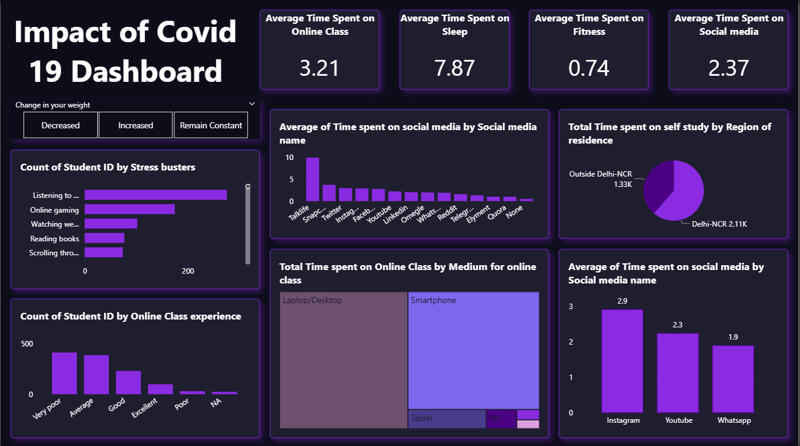

# 🦠 Impact of COVID-19 Dashboard

An interactive **Power BI dashboard** analyzing how the COVID-19 pandemic affected students’ daily habits, mental health, and learning experience.  
This dashboard visualizes behavioral patterns related to **sleep**, **online learning**, **social media usage**, **fitness**, and **stress management** during the lockdown period.

---

## 📊 Dashboard Overview

The **Impact of COVID-19 Dashboard** explores lifestyle and academic activity changes among students throughout the pandemic.  
It provides insights into how students adapted to remote learning and managed stress during uncertain times.

---

## 🔹 Key Metrics

| Metric | Average Time (Hours) |
|--------|----------------------|
| **Online Class** | 3.21 |
| **Sleep** | 7.87 |
| **Fitness** | 0.74 |
| **Social Media** | 2.37 |

---

## 📈 Visual Insights

| Visualization | Description |
|----------------|-------------|
| **Change in Weight Filter** | Allows filtering insights based on whether students’ weight increased, decreased, or remained constant. |
| **Count of Students by Stress Busters** | Shows how students coped with stress — listening to music, gaming, reading, or watching web series. |
| **Average Time Spent on Social Media Platforms** | Compares time spent on different platforms such as Instagram, YouTube, Twitter, and WhatsApp. |
| **Total Time on Self-Study by Region** | Highlights differences between students inside and outside Delhi-NCR. |
| **Online Class Experience Ratings** | Displays how students rated their online learning experience (from Very Poor to Excellent). |
| **Medium of Online Classes** | Analyzes which devices (Smartphone, Laptop/Desktop, Tablet) students primarily used for online learning. |
| **Average Time on Social Media (Top Platforms)** | Identifies top platforms — Instagram (2.9h), YouTube (2.3h), WhatsApp (1.9h). |

---

## 🧠 Key Insights

- **Listening to music** was the most common stress-relief activity among students.  
- **Smartphones** were the dominant medium for attending online classes.  
- Students spent **nearly 8 hours sleeping** and over **2 hours on social media** daily.  
- The **majority rated** their online class experience as *Average* or *Very Poor*.  
- **Students from Delhi-NCR** recorded higher total self-study hours compared to others.  

---

## ⚙️ Tools & Techniques Used

- **Power BI Desktop**  
- **Data Source:** COVID-19 Student Lifestyle Dataset (CSV/Excel)  
- **Techniques:**
  - DAX for calculating averages and totals
  - Filters and slicers for interactivity
  - Dark theme for visual contrast and clarity
  - Custom KPIs and visual alignment for better storytelling

---

## 🚀 How to Use

1. Download the file **`Covid-19.pbix`** from this repository.  
2. Open it in **Power BI Desktop**.  
3. Use filters (e.g., *Change in Weight*) to view segmented insights.  
4. Hover over charts to explore interactive tooltips and comparisons.

---

## 📸 Dashboard Preview

---

## 📁 File Details
- **File Name:** `Covid-19.pbix`  
- **Created With:** Power BI Desktop  
- **Dataset:** COVID-19 Student Lifestyle Data  

---

⭐ *If this dashboard inspired your own data storytelling, don’t forget to star ⭐ the repository!*
